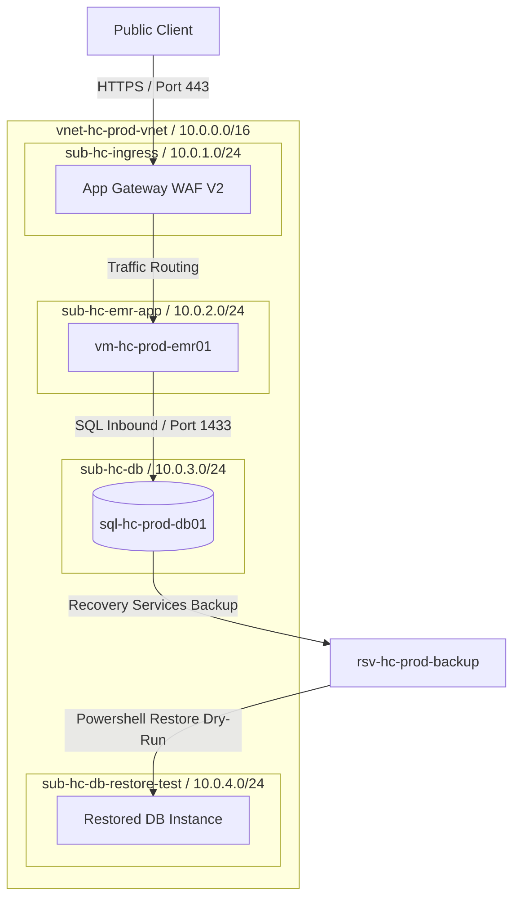
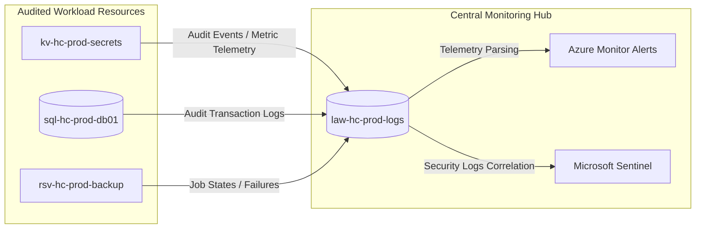
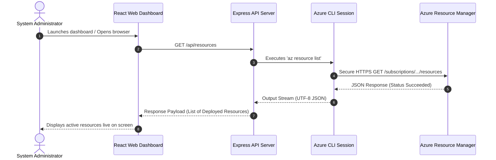

# Azure Healthcare Platform - Architecture & Data Flow Diagram

This document presents the visual architecture layouts, transaction sequences, authentication boundaries, and data flow structures of the **Azure Healthcare Platform Dashboard**.

---

## 1. Deployed Landing Zone Network Topology

The production workload is designed with a hub-and-spoke VNet configuration to isolate database resources, application VMs, and ingress components within separate subnet boundaries in the `southeastasia` region.



---

## 2. Telemetry and Logging Architecture

This diagram maps how infrastructure diagnostics, Key Vault access events, and backup job statuses stream into Azure Monitor and Log Analytics to establish our compliance baseline:



---

## 3. Integration Dashboard Architecture (Current State)

This diagram shows how the React dashboard communicates with the local Node.js backend server and retrieves live resources from Microsoft Azure:

```mermaid
graph TD
    %% Frontend Layer
    subgraph UI ["Frontend User Interface (Vite + React)"]
        Dashboard["Operations Control Center (App.tsx)"]
        Refresher["Auto-Refresh Hook (Every 60s)"]
    end

    %% Backend Layer
    subgraph BE ["Backend Integration Service (Node.js + Express)"]
        ExpressServer["Express API Server (Port 3001)"]
        ChildProcess["Child Process Executor (exec)"]
    end

    %% Cloud Auth & API Layer
    subgraph Azure ["Microsoft Azure Cloud Platform"]
        AzureCLI["Azure CLI Context (Active Login)"]
        ARM["Azure Resource Manager APIs"]
        RG["Resource Group: RG-Healthcare-Prod"]
        RSV["Recovery Services Vault"]
        KV["Key Vault Premium"]
        AL["Azure Monitor Alert Rules"]
    end

    %% Mappings & Flow
    Refresher -->|Periodic Polling| Dashboard
    Dashboard -->|API Requests (GET /api/...)| ExpressServer
    ExpressServer -->|Executes AZ Commands| ChildProcess
    ChildProcess -->|Token Handshake| AzureCLI
    AzureCLI -->|REST Authentication| ARM
    ARM -->|Queries Resources| RG
    ARM -->|Checks Backup Status| RSV
    ARM -->|Audits Key Vault| KV
    ARM -->|Validates Alert State| AL
```

---

## 4. End-to-End Request Sequence

This diagram maps the sequence of an operator opening the dashboard and viewing live resources:


