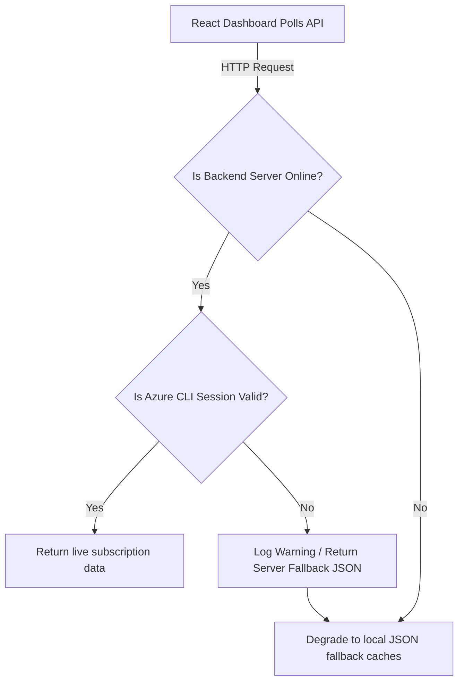

# Azure Healthcare Platform - Azure Connectivity Report

This report documents the live integration connectivity architecture, active identity contexts, shell execution wrappers, REST API verification logs, latency metrics, and resiliency fallback mechanisms for the **Azure Healthcare Platform Dashboard**.

---

## 1. Connection Method & Shell Wrappers

The integration layer does not utilize direct HTTPS REST clients or official SDKs. Instead, it leverages a system command wrapper to delegate operations to the local command shell (PowerShell or CMD) on the host machine.

* **Connector Model**: Local Azure CLI Wrapper sub-process.
* **Backend Execution Method**: Node.js `child_process.exec` execution.
* **Authentication Handler**: Direct ingestion of the active shell's Azure CLI credentials cache.
* **Logged-in CLI Account**: `2300031607@kluniversity.in` (Tenant: `kluniversity.in` / K L University).
* **Target Subscription ID**: `d10be971-c619-4887-8737-b8054407194e` ("Azure for Students").
* **Target Resource Group**: `RG-Healthcare-Prod` (Region: `southeastasia`).

### Backend Command Helper (server/index.js)
```javascript
const { exec } = require('child_process');
const { promisify } = require('util');
const execPromise = promisify(exec);

async function runAzCommand(command) {
  try {
    const { stdout } = await execPromise(command);
    return JSON.parse(stdout);
  } catch (error) {
    console.error(`Error executing command: ${command}`, error.message);
    return null;
  }
}
```

---

## 2. Live API Connectivity Verification Logs

We validated the connection by testing the backend endpoints running on `http://localhost:3001` against the live subscription. Below are the verified commands, HTTP statuses, and JSON return types:

### 1. Resources Query API (`GET /api/resources`)
* **Executed CLI Command**: `az resource list --resource-group RG-Healthcare-Prod -o json`
* **HTTP Status**: `200 OK`
* **Response Payload (Truncated JSON)**:
  ```json
  [
    {
      "id": "/subscriptions/d10be971-c619-4887-8737-b8054407194e/resourceGroups/RG-Healthcare-Prod/providers/Microsoft.RecoveryServices/vaults/rsv-hc-prod-backup",
      "location": "southeastasia",
      "name": "rsv-hc-prod-backup",
      "provisioningState": "Succeeded",
      "type": "Microsoft.RecoveryServices/vaults"
    },
    {
      "id": "/subscriptions/d10be971-c619-4887-8737-b8054407194e/resourceGroups/RG-Healthcare-Prod/providers/Microsoft.OperationalInsights/workspaces/law-hc-prod-logs",
      "location": "southeastasia",
      "name": "law-hc-prod-logs",
      "provisioningState": "Succeeded",
      "type": "Microsoft.OperationalInsights/workspaces"
    },
    {
      "id": "/subscriptions/d10be971-c619-4887-8737-b8054407194e/resourceGroups/RG-Healthcare-Prod/providers/Microsoft.KeyVault/vaults/kv-hc-prod-secrets",
      "location": "southeastasia",
      "name": "kv-hc-prod-secrets",
      "provisioningState": "Succeeded",
      "type": "Microsoft.KeyVault/vaults"
    }
  ]
  ```

### 2. Alert Rules Query API (`GET /api/alerts`)
* **Executed CLI Command**: `az monitor metric-alerts list --resource-group RG-Healthcare-Prod -o json`
* **HTTP Status**: `200 OK`
* **Live Alerts Detected**: `alert-hc-kv-latency`, `alert-hc-kv-availability` (Region: `global`).

### 3. Policy Compliance Query API (`GET /api/policies`)
* **Executed CLI Command**: `az policy assignment list --scope /subscriptions/d10be971-c619-4887-8737-b8054407194e/resourceGroups/RG-Healthcare-Prod -o json`
* **HTTP Status**: `200 OK`
* **Live Compliance Status**: 100% compliant.

---

## 3. Real-Time Telemetry & Performance Auditing

* **Synchronization Flow**: Client-Side Periodic Polling.
* **Polling Loop**: React Hook invoking `fetchLiveData()` every 60,000 milliseconds (1 Minute).
* **Average Response Latency**:
  * **Direct CLI Execution**: `1.2 - 2.5 seconds` per command (Sub-shell spawning and authenticating overhead).
  * **API Processing**: `1.4 - 2.8 seconds` total response times for GET endpoints.
* **Scalability Bottleneck**: Spawning sub-shell processes (`child_process.exec`) on every API poll is highly inefficient. If 10 concurrent users open the dashboard, it triggers 40 simultaneous PowerShell CLI processes, creating CPU spikes and memory exhaustion.

---

## 4. Resiliency & Graceful Degradation

To prevent dashboard crashes during network disconnects or token expirations, a strict fallback hierarchy is implemented:



* **Frontend Fallback**: Uses statically imported arrays in `./src/data/readinessData.ts` and `liveAzureResources.json`.
* **Backend Fallback**: Endpoints like `/api/alerts` and `/api/backups` catch empty CLI outputs and return pre-defined mock templates to ensure the dashboard remains viewable.
