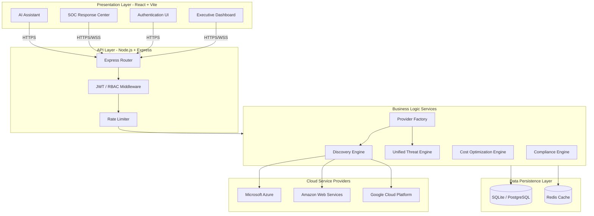

# CloudOps Enterprise - Architecture Overview

CloudOps Enterprise is a unified, multi-tenant Cloud Security Posture Management (CSPM) and Financial Operations (FinOps) platform. It provides a single pane of glass across Azure, AWS, and GCP.

## Core Tenets
- **Agentless Discovery:** Integrates directly with native Cloud APIs (Azure Resource Graph, AWS STS) without requiring agents installed on endpoints.
- **Multi-Tenant SaaS:** Logical isolation at the database layer ensuring enterprise environments are strictly partitioned.
- **Real-Time Intelligence:** Utilizing WebSockets (SSE) for live synchronization of Threat Events and Resource state changes.
- **AI-Powered Operations:** Deep integration with Large Language Models to provide contextual remediation scripts and executive summarization.

## High-Level Architecture

## Platform Extensibility
The platform utilizes a `ProviderFactory` pattern. Adding a new Cloud Provider requires implementing the standard interface contracts (Discovery, Costs, Threats) without modifying the core routing logic or frontend visualizations.
