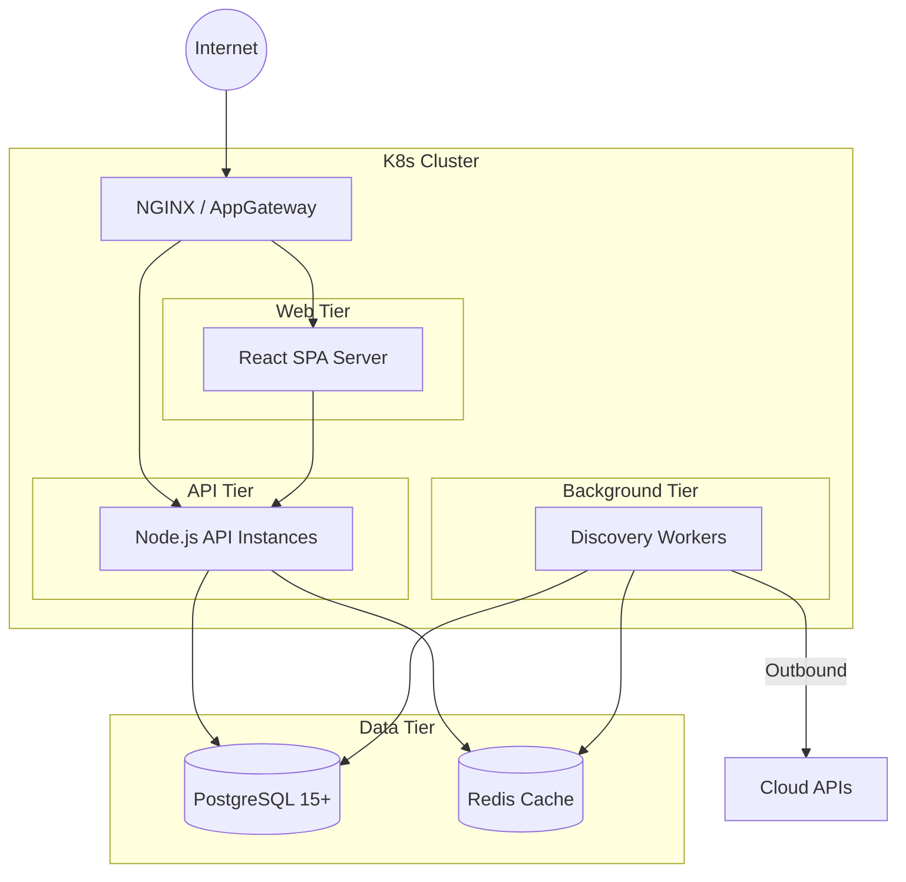

# Deployment Architecture

CloudOps Enterprise is designed to be deployed across any containerized or virtualized environment.

## Deployment Models

### 1. Docker Compose (Local / Dev / Portfolio)
The quickest path to a running instance. Suitable for portfolio presentations and local development.
- Single container orchestrating Node.js API and serving static Vite/React bundles.
- Uses local `cloudops.db` SQLite engine.

### 2. Enterprise Cloud Native (AWS EKS / Azure AKS)
For production workloads, the application splits cleanly.

## Production Readiness Checklist
Before taking CloudOps Enterprise live, ensure the following checklist is completed:

- [ ] **SSL/TLS Certificates:** Terminated at the Ingress controller or Load Balancer.
- [ ] **Database Migration:** Switched from SQLite to PostgreSQL by altering the DB engine dialect in `database.js`.
- [ ] **Secret Management:** Replaced `.env` hardcoding with Azure KeyVault or AWS Secrets Manager injection.
- [ ] **WebSockets:** Ensured the Load Balancer supports sticky sessions and HTTP/1.1 Upgrade headers for SSE/WebSockets.
- [ ] **Monitoring:** Datadog or Prometheus metrics scraping configured on the `/metrics` endpoint.
