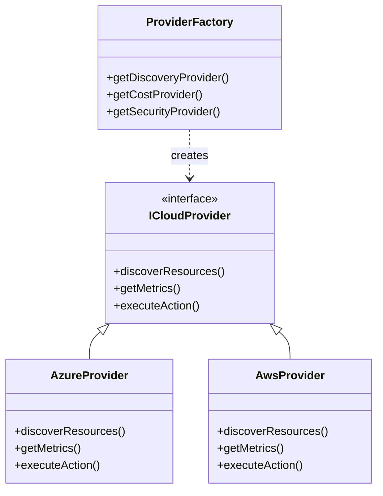

# Multi-Cloud Architecture & ProviderFactory

To achieve a true "Single Pane of Glass", CloudOps Enterprise abstracts vendor-specific SDKs behind a unified integration layer known as the `ProviderFactory`.

## The ProviderFactory Pattern
Instead of writing conditional `if (azure) { ... } else if (aws) { ... }` logic throughout the application, all business services call generic methods on the factory.

## Cloud Provider Implementations

### Azure Architecture
- Uses `@azure/arm-resources` and `@azure/identity`.
- Implements parallel fetching across **Azure Resource Graph** (for deep analytics) and **ARM Generic List** (for immediate consistency).

### AWS Architecture
- Uses `@aws-sdk/client-sts` and generic resource tagging APIs.
- Built to utilize **Cross-Account IAM AssumeRole** (Enterprise best practice) over static Access Keys.

### GCP Architecture
- Designed around Google Cloud Resource Manager.
- Future-ready stub implemented in `GcpProvider.js`.
