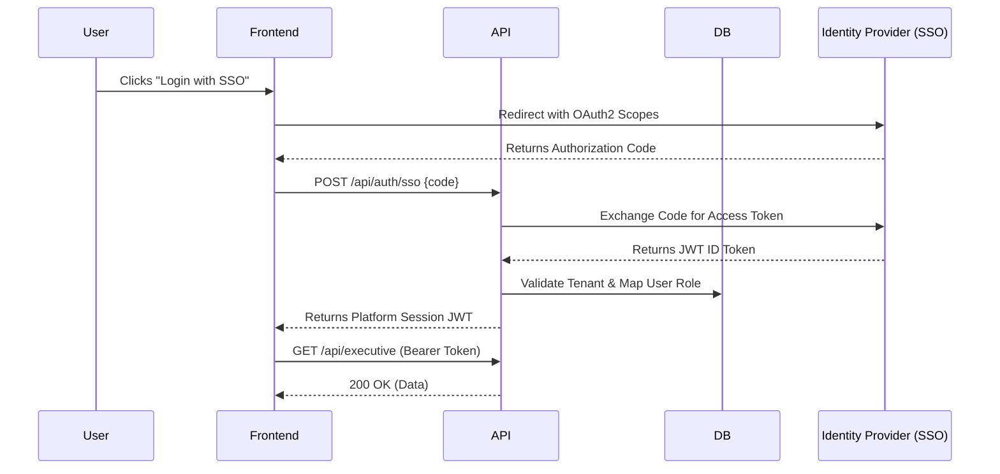

# Platform Security Design

Security is integrated at every layer of CloudOps Enterprise.

## Authentication & Authorization

## Multi-Tenant Data Isolation
- **Row-Level Security (RLS)**: Queries inherently inject `WHERE tenant_id = ?` directly from the authenticated JWT session middleware. No cross-tenant data leakage is structurally possible in standard queries.
- **Least Privilege Execution**: The Action Engine strictly binds to the IAM Role or Service Principal associated *only* with the requesting tenant.

## Secrets Management
- **Encryption at Rest**: Client secrets (AWS Access Keys, Azure App Secrets) are AES-256-GCM encrypted in the database using a master rotation key (`JWT_SECRET` / KMS Key).
- **In-Memory Volatility**: Credentials are only decrypted into memory precisely at the time of SDK instantiation and are instantly garbage collected.

## Compliance
- All actions executed by the platform (e.g., "Restart VM", "Apply NSG Rule") generate an immutable Audit Log assigned to the triggering User ID, visible in the Governance Dashboard.
