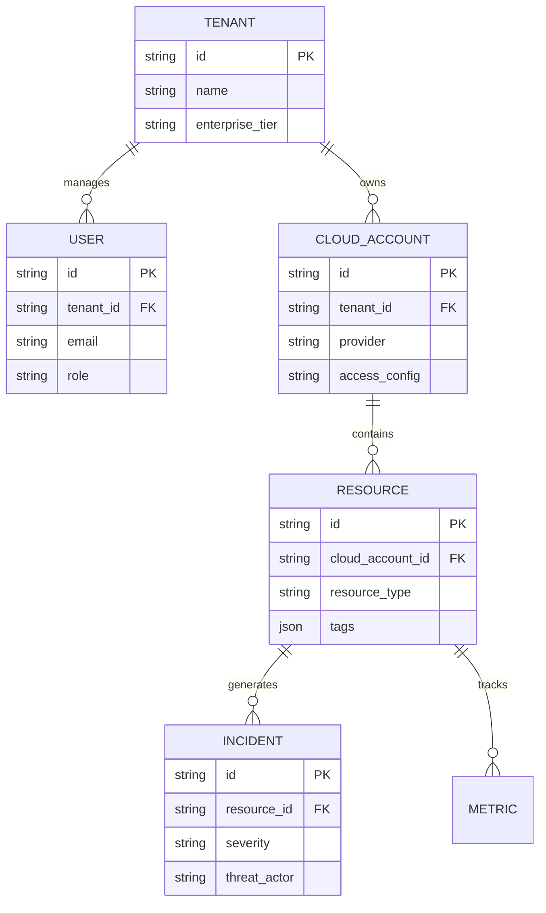

# System Design

This document details the internal module interaction, database architecture, and performance characteristics of CloudOps Enterprise.

## Backend Microservices (Monolithic API Gateway)
To optimize operational overhead while maintaining separation of concerns, the backend is built as a modular monolith running in Node.js. 

### Modules:
1. **Discovery Engine (`discoveryEngine.js`)**: Executes high-throughput, parallel scans against Cloud APIs (e.g., Azure Resource Graph, AWS STS). Implements Exponential Backoff and rate-limit recovery mechanisms.
2. **Threat Engine (`unifiedThreatEngine.js`)**: Aggregates signals from Azure Security Center, AWS GuardDuty, and GCP Security Command Center into a normalized MITRE ATT&CK schema.
3. **AI Assistant (`aiService.js`)**: Handles context windowing for prompt engineering to generate infrastructure-as-code snippets and remediation advice.
4. **Action Router (`actionService.js`)**: Safely executes write-actions (e.g., stopping a rogue VM) against cloud providers using localized Least Privilege Identity bindings.

## Database Schema Design (SQLite / PostgreSQL)

## Resiliency & Caching
- **State Hydration**: Resources are cached locally in the database. The Discovery Engine polls/listens for deltas and updates the database natively, avoiding repeated heavy API calls to the Cloud providers.
- **Circuit Breakers**: SDK integrations feature built-in 429 (Too Many Requests) circuit breakers to avoid penalizing the entire platform if a single tenant exceeds rate limits.
