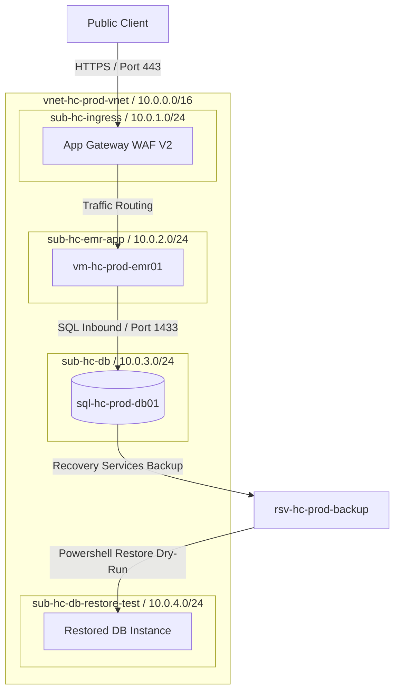
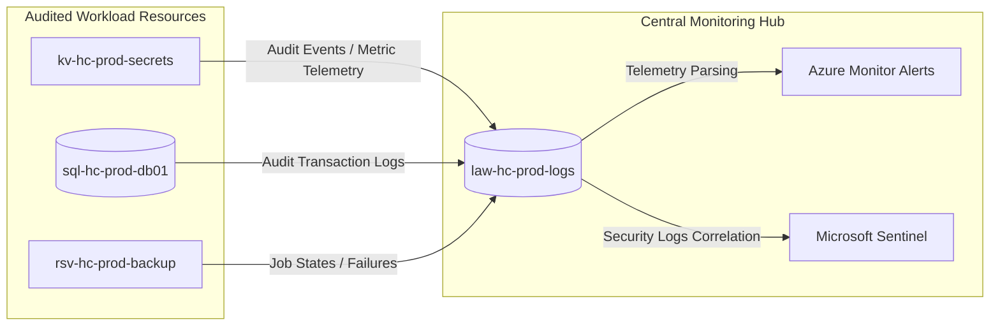

# Technical Architecture Diagram & Layout

This document provides visual representations of the **Azure Healthcare Cloud Landing Zone** using Mermaid diagrams, detailing network isolation, diagnostic flows, and backup replication routing.

---

## 🌐 1. Landing Zone VNet Topology

The diagram below maps the private subnet partitions, application gateway ingress WAF, and database endpoints deployed in the `southeastasia` region:

---

## 📈 2. Centralized Diagnostic Log Stream

This diagram maps how resource logs, administrative actions, and audit reports stream into the Log Analytics Workspace:

