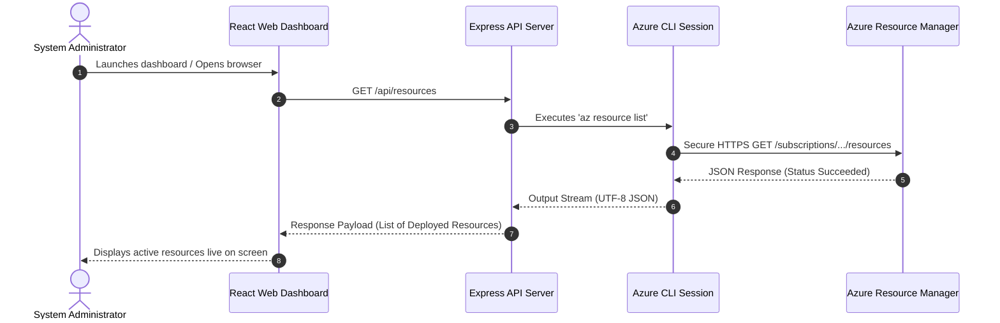

# Live Integration Architecture Diagram

This document illustrates the technical architecture and request sequence workflow for the live-connected **Azure Healthcare Operations Dashboard**.

---

## 🏗️ Technical Architecture Diagram

```mermaid
graph TD
    %% Frontend Layer
    subgraph UI ["Frontend User Interface (Vite + React)"]
        Dashboard["Operations Control Center (App.tsx)"]
        Refresher["Auto-Refresh Hook (Every 60s)"]
    end

    %% Backend Layer
    subgraph BE ["Backend Integration Service (Node.js + Express)"]
        ExpressServer["Express API Server (Port 3001)"]
        ChildProcess["Child Process Executor (exec)"]
    end

    %% Cloud Auth & API Layer
    subgraph Azure ["Microsoft Azure Cloud Platform"]
        AzureCLI["Azure CLI Context (Active Login)"]
        ARM["Azure Resource Manager APIs"]
        RG["Resource Group: RG-Healthcare-Prod"]
        RSV["Recovery Services Vault"]
        KV["Key Vault Premium"]
        AL["Azure Monitor Alert Rules"]
    end

    %% Mappings & Flow
    Refresher -->|Periodic Polling| Dashboard
    Dashboard -->|API Requests (GET /api/...)| ExpressServer
    ExpressServer -->|Executes AZ Commands| ChildProcess
    ChildProcess -->|Token Handshake| AzureCLI
    AzureCLI -->|REST Authentication| ARM
    ARM -->|Queries Resources| RG
    ARM -->|Checks Backup Status| RSV
    ARM -->|Audits Key Vault| KV
    ARM -->|Validates Alert State| AL
```

---

## 🔄 Sequence Flowchart


