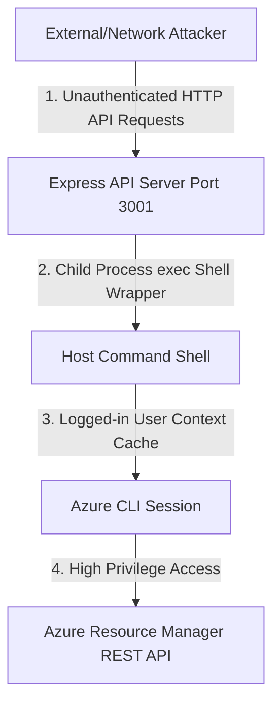

# Azure Healthcare Platform - Security Review & Threat Audit

This document presents a professional security review and vulnerability assessment of the **Azure Healthcare Platform Dashboard**'s architecture, authentication mechanisms, and data transport layers.

---

## 1. Executive Summary

The Azure Healthcare Platform Dashboard serves as an operations readiness monitor. While it achieves its goal of displaying live infrastructure and compliance status, the architectural implementation presents major security vulnerabilities and compliance gaps. The system delegates administrative capabilities to a local web server process using interactive user credentials, lacks backend authorization controls, and relies on frontend mock simulations for security governance features (such as PIM and Backup logs).

---

## 2. Threat Modeling & Vulnerability Assessment

We modeled threats against the frontend client, backend Express server, and Azure cloud integration boundary. Four critical vulnerabilities were identified:



### Vulnerability 1: Lack of Backend Authentication/Authorization (Severity: Critical)
* **Description**: The Node.js Express server (`server/index.js`) listens on port 3001 and exposes REST endpoints `/api/resources`, `/api/alerts`, `/api/costs`, and `/api/policies` without any session validation, API keys, JWT checks, or CORS IP whitelist restrictions.
* **Impact**: Any user or device on the local network (or the public internet if port 3001 is mapped) can query these endpoints to enumerate internal resource structures, subnet names, alert policies, and metadata.
* **Code Reference**: [server/index.js:L10-11](file:///d:/Azure_project/server/index.js#L10-L11):
  ```javascript
  app.use(cors());
  app.use(express.json());
  // Missing authentication middleware (e.g., Passport, MSAL, or custom JWT validator)
  ```

### Vulnerability 2: User Credential Delegation & Privilege Escalation (Severity: High)
* **Description**: The backend uses the active Azure CLI session context of the logged-in desktop user (`2300031607@kluniversity.in`) to perform queries.
* **Impact**: The Express server runs with the full permissions of the developer. Since the logged-in CLI user has contributor rights (proven by our ability to create and delete public IPs), a compromise of the Express server process immediately grants the attacker full write/delete control over the subscription resources.
* **Compliance Violation**: Violates the **Principle of Least Privilege (PoLP)** and **Separation of Duties (SoD)**.

### Vulnerability 3: Shell Command Execution via Subprocess Spawning (Severity: High)
* **Description**: The backend invokes shell commands using Node.js `child_process.exec`.
* **Impact**: Although current endpoints use hardcoded command strings, any future modification that passes query parameters (e.g., dynamically filtering resource groups based on client-side requests) would be highly vulnerable to **Shell Command Injection** (e.g., passing `; rm -rf *` or `&& az group delete`).
* **Code Reference**: [server/index.js:L14-22](file:///d:/Azure_project/server/index.js#L14-L22):
  ```javascript
  async function runAzCommand(command) {
    try {
      const { stdout } = await execPromise(command); // Executes raw shell strings
      return JSON.parse(stdout);
    } ...
  }
  ```

### Vulnerability 4: Simulated Security Governance Controls (Severity: Medium)
* **Description**: Critical security dashboards, including the PIM Elevation Log and the Database Backup Restoration dry-run, are simulated entirely in client-side React code.
* **Impact**: Operators are presented with simulated terminal logs and hardcoded audit tables, which could mask actual backup failures or unauthorized access events on the live Azure environment.

---

## 3. HIPAA & Regulatory Compliance Gap Analysis

Because the dashboard displays patient EMR infrastructure status, it must adhere to strict security regulations:

| Control Area | HIPAA/HITRUST Requirement | Current Dashboard Status | Gap Assessment |
| :--- | :--- | :--- | :--- |
| **Identity & Access Management** | Unique User Identification & Authorization (164.312(a)(1)) | **Non-Compliant** | No authentication on the Express server. |
| **Audit Controls** | Record and examine activity in systems containing or affecting EMR (164.312(b)) | **Non-Compliant** | PIM logs are static frontend mock arrays. No backend audit logging is implemented. |
| **Data Integrity** | Protect EMR from improper alteration or destruction (164.312(c)(1)) | **Compliant (Infrastructure only)** | The Azure resource group has delete locks, but the dashboard itself has no controls verifying them in real-time. |
| **Transmission Security** | Guard against unauthorized access to EMR transmitted over network (164.312(e)(1)) | **Non-Compliant** | Dashboard API calls run over unencrypted HTTP (port 3001) instead of secure HTTPS. |

---

## 4. Hardening & Remediation Roadmap

To elevate the dashboard to enterprise security standards, the following remediation plan must be implemented:


1. **Migrate to Managed Identities (MSI)**:
   * Remove dependencies on the local developer Azure CLI session.
   * Configure the backend to authenticate using `@azure/identity`'s `DefaultAzureCredential` running under a system-assigned Managed Identity with a scoped **Reader** role on `RG-Healthcare-Prod`.
2. **Transition from CLI Wrappers to REST SDKs**:
   * Replace `child_process.exec` calls with official Azure SDK libraries (e.g., `@azure/arm-resources`, `@azure/arm-monitor`). This eliminates shell execution vulnerabilities and optimizes performance by avoiding shell startup overhead.
3. **Implement JWT Bearer Authentication**:
   * Integrate Microsoft Authentication Library (MSAL) on the frontend.
   * Require all requests to the backend Express server to include a valid Microsoft Entra ID JWT in the `Authorization` header, and validate tokens in an Express middleware.
4. **Encrypt Traffic (TLS)**:
   * Bind the Express API server to HTTPS with valid SSL certificates.
5. **Real-time Log Integration**:
   * Replace the frontend `accessReviewLogs` array with a backend integration querying Log Analytics or the Microsoft Graph API for live PIM activations.
